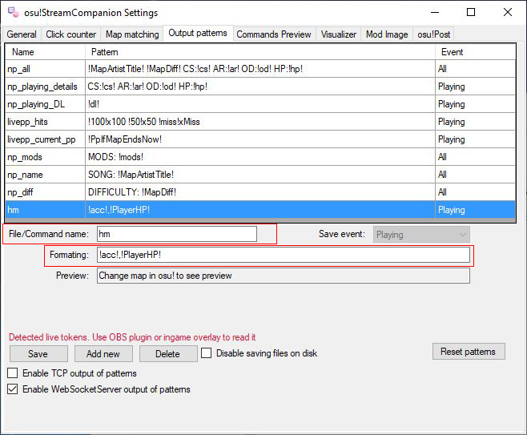

# osu!Stream Health Meter
 
Addition to osu!StreamCompanion by Piotrekol. This is not a finished program yet.

# Set up your osu!StreamCompanion
First, you need to enable Web Socket Server output of patterns

After that create the pattern as shown below. It must have the name "hm" and formatting "!acc!,!PlayerHP!" (without quotes)

